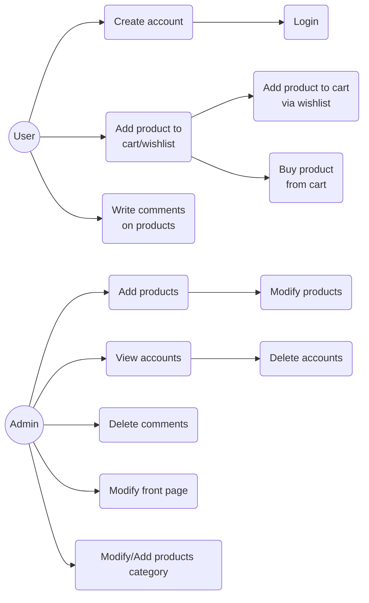
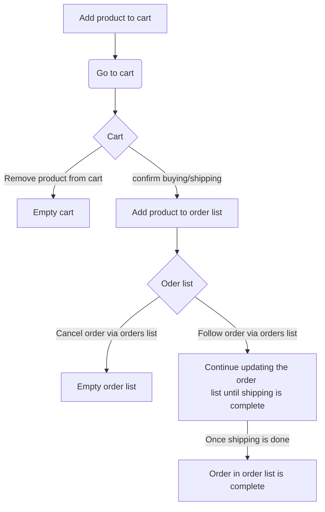
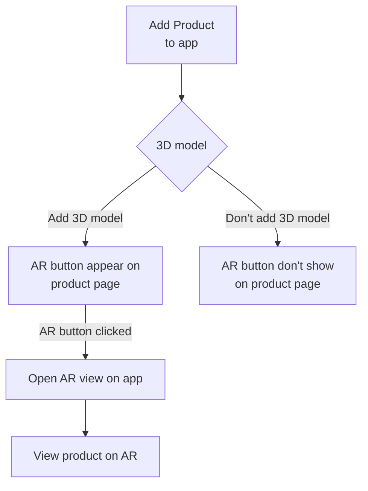

# I. Summary

# 

&nbsp;

&nbsp;

&nbsp;

# II. Project description

&nbsp;

&nbsp;

&nbsp;

&nbsp;

&nbsp;

# III. **Architecture** 

## Use Case :

## Buying Workflow :

## AR Workflow :

&nbsp;

# IV. **Planning & budget**

&nbsp;

&nbsp;

&nbsp;

# V. **Annexes**

## Wireframe(User) :

&nbsp;

## Wireframe(Admin) :

&nbsp;

&nbsp;

&nbsp;

#### **I. Résumé**

- **Nom de l'application**

- **Date de création**

- **Version**

- **Auteur**

- **Objectifs de l'application**

- **Public cible**

- **Plateformes cibles** (iOS, Android, web)

- **Budget**

- **Délai de réalisation**

#### **II. Description du projet**

- **Besoin métier** : Détaillez le problème que l'application vise à résoudre et les besoins des utilisateurs.

- **Fonctionnalités** : Décrivez les fonctionnalités principales et secondaires de l'application, en précisant leur importance et leur fonctionnement.

- **Ergonomie et design** : Définissez l'interface utilisateur (UI) et l'expérience utilisateur (UX) recherchées, en précisant les couleurs, les typographies, les styles graphiques, etc.

- **Contenus** : Décrivez les types de contenus qui seront présents dans l'application (textes, images, vidéos, etc.).

- **Spécifications techniques** : Détaillez les technologies et les frameworks qui seront utilisés pour le développement de l'application.                              (database)

#### **III. Architecture UML** 

- Diagramme de cas d'utilisation (USE CASE)

- Diagramme de d'activité

- Diagramme de classe&nbsp;

#### **IV. Planning et budget**

- **Détaillez les différentes étapes du projet** (conception, développement, tests, etc.) et le planning associé.

- **Prévoyez un budget** pour chaque étape du projet, en tenant compte des ressources humaines et matérielles nécessaires.

#### **IV. Annexes** 

- **Wireframes** (représentations schématiques de l'interface utilisateur)

- **Charte graphique**

<SwmMeta version="3.0.0" repo-id="Z2l0aHViJTNBJTNBTVlHX1Byb2plY3RfNCUzQSUzQVdlZVNlS2s=" repo-name="MYG_Project_4">Powered by [Swimm](https://app.swimm.io/)</SwmMeta>
